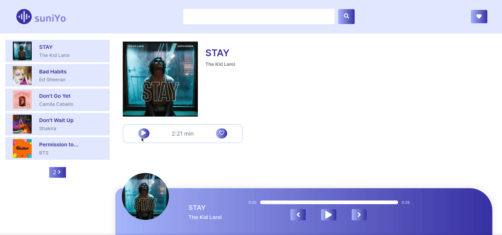

<p align="center">
    
    <br>
    <br>
</p>

Wanna find the latest music and listen to your favourite songs ? Catch them all on *Suniyo*. A React-only single page application to search and stream music. 

## Demo
<p align="center">
    
</p>

## Quick Setup :heavy_check_mark :

1. Clone [this](https://github.com/SlaYpoint/suniYo) repo.

```
git clone https://github.com/SlaYpoint/suniYo.git && cd suniYo
```

2. Install required dependencies.

```
yarn build
```

3. Rename the `env.sample` file to `env` and inside it add

```
REACT_APP_API_KEY=yourApiKey
```

4. To start the development server :

```
yarn start
```

## Tech Stack


## API Used
For music : [Deezer API](https://rapidapi.com/deezerdevs/api/deezer-1/endpoints) 

## ToDo
- Improve preloader
- Fix device responsivness
- Add Lyrics card
- Add Liked music
- Persist liked music data 

## ⚠️ Note
This application is still under its initial stages and not for any commercial purposes.